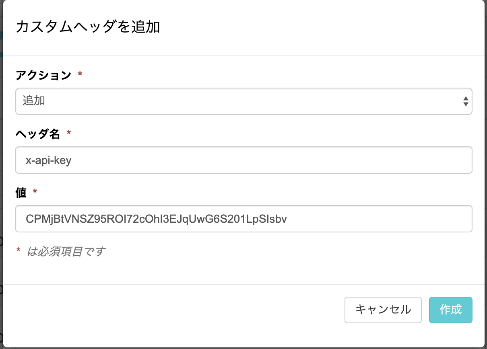
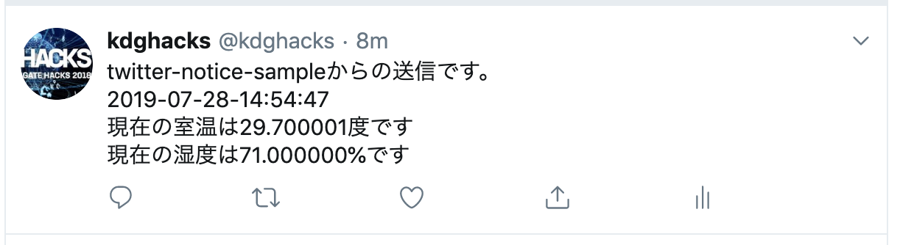
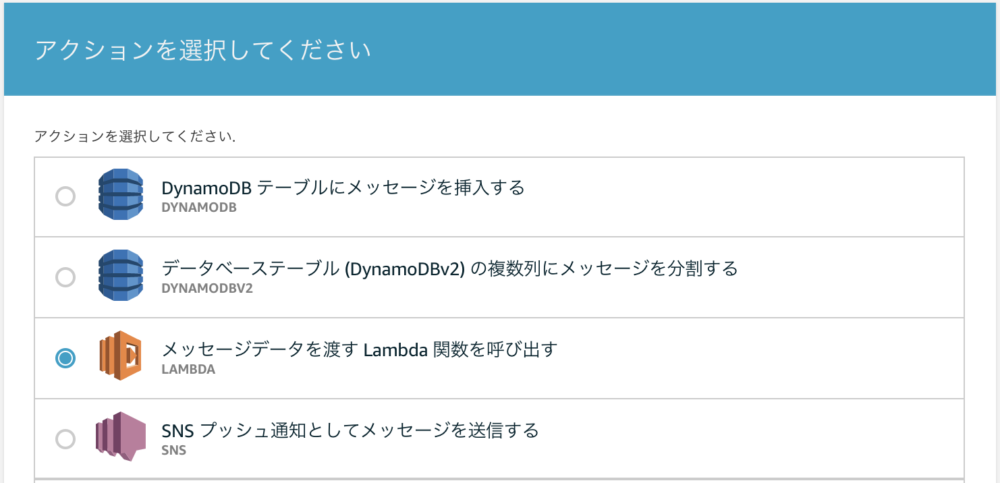

# IoT ハンズオン

## 概要
このハンズオンでは、[Wio LTE M1/NB1(BG96)](https://soracom.jp/products/module/wio_lte_m1_nb1/)、SORACOM各種サービス(SORACOM Air, Harvest, Beam)、AWS(API Gateway, IoT Core, Lambda)を利用し、IoTシステムのサービス開発を行います。

## 事前準備
- IoTデバイスを手元に用意してください。
    - マイコンモジュール: Wio LTE M1/NB1(BG96)
    - IoTセンサー
        - 今回のハンズオンでは、温湿度センサーと距離センサーを利用します。他にもいくつか用意していますので、[Step4:自由課題](#step4:自由課題)で使ってみてください。

        |製品名|製品説明|サンプルコード|
        |-----|-------|-----------|
        |[温湿度センサー](http://wiki.seeedstudio.com/Grove-TemperatureAndHumidity_Sensor/)|湿度と温度を取得する|[サンプル](./device-sample/Hello-TempHumi/Hello-TempHumi.ino)|
        |[距離センサー](http://wiki.seeedstudio.com/Grove-Ultrasonic_Ranger/)|センサーからの距離を取得する。取得可能な範囲は2-350cmで、取得単位は、cm|[サンプル](./device-sample/Hello-Ultrasonic/Hello-Ultrasonic.ino)|

- Wio LTEの開発環境の構築を行います。手順に従い準備をお願いします。
    - [環境セットアップ手順](https://github.com/SeeedJP/Wiki/blob/master/Wio_cell_lib_for_Arduino/setup-ja.md) の手順に従い、ボード(Seeed Wio LTE M1/NB1(BG96))の追加、ライブラリの追加をお願いします。
- SORACOM アカウント, SIMカード（plan-KM1 1枚)の準備
    - 各チームごとに、SORACOMアカウント、IoT SIMカード（plan-KM1）を用意していますので、アカウント情報を確認し、ログインできることを確認してください。
- AWSアカウントの準備
    - 各チームごとに、AWSアカウントを用意していますので、アカウント情報を確認し、ログインできることを確認してください。

## ハンズオン概要

今回のハンズオンでは、IoTデバイスからセンサー情報をクラウドへ送信し、センサー情報の可視化、センサー情報を元にしたツイート・家電操作を行います。

- [Step0](#Step0:開発環境の動作確認): LEDの点灯（開発環境の動作確認）
- [Step1](#Step1:センサー情報の可視化): 温湿度センサー情報の可視化
- [Step2](#Step2:SORACOM-Beam-と-AWS(API-Gateway,-Lambda)を利用したツイート機能): SORACOM Beam と AWS(API Gateway, Lambda)を利用したツイート機能
- [Step3](#Step3:SORACOM-Beam-と-AWS(AWS-IoT,-Lambda)を利用した家電操作): SORACOM Beam と AWS(AWS IoT, Lambda)を利用した家電操作
- [Step4](#Step4:自由課題): 自由課題

## Step0:開発環境の動作確認

セットアップが正しく行われているか確認するために、以下の手順に従い、LEDを点灯させることができるか確認します。LEDが点灯しない場合は、環境構築手順に戻り、再度セットアップをしてみてください。

1. Arduino IDEを開き、ツール -> ボード から、Seeed Wio LTE M1/NB1 (BG96)を選択してください。

    

1. ファイル -> スケッチ例 -> Wio cell for Arduino -> basic -> LedSetRGB を選択してください。

    

1. PCにArduinoを接続したあと、左上の右矢印ボタン(マイコンボードに書き込む)をクリックします。「ボードの書き込みが完了しました。」と表示され、ArduinoのLEDが点灯したら、セットアップは完了です。

## Step1:センサー情報の可視化

温湿度センサーから取得した温度・湿度の情報を、SORACOM Harvestに送り、可視化します。

### 全体の構成


### SORACOM Air, Harvest
- [SORACOM Air for セルラー](https://soracom.jp/services/air/cellular/)
    - SORACOM Air for セルラーは、IoT 向けのデータ通信 SIM "IoT SIM" を提供するサービスです。
    - 1枚から購入可能​で、最安基本料金50円〜/月と低コストで始められます。Web/APIで通信の運用監視、容易な​クラウド連携、閉域網接続や​オンデマンドリモートアクセスにも対応しており、IoTのつなぐを簡単にします。
- [SORACOM Harvest](https://soracom.jp/services/harvest/)
    - SORACOM Harvest(Harvest)とは、IoT デバイスからのデータを収集、可視化およびファイルを保存するサービスです。SORACOM Air が提供するセルラー通信、LPWAでの通信を使って、IoT デバイスのセンサーデータ等を手間なくクラウドにアップロードできます。また、SORACOM Harvest は画像ファイルやログファイルなどのファイルにも対応しています。
    - お客様は、IoT デバイスから送信されたデータおよびファイルをユーザーコンソールや API から確認およびダウンロードできます。

### 温湿度センサーからセンサー値を取得する

1. 温湿度センサーから値を取得する[サンプルコード](./device-sample/Hello-TempHumi/Hello-TempHumi.ino)をArduino IDEで開きます。デバイスへ書き込み、シリアルモニタから、温度、湿度が表示されていることを確認してください。

    

    - シリアルモニタを開くには、ツール -> シリアルポートから、Arduinoを接続したポートを選択したあと、ツール -> シリアルモニタ を選択してください。

        

### SORACOM Harvestを利用し、データを可視化する

1. SORACOMコンソールへログインし、左上のMenuを選択し、SIMグループを選択してください。

    

1. 各チームごとにグループを作成していますので、各チームに割り当てられたSIMグループを選択し、SORACOM Harvest設定を開き、ONにした後、保存を選択してください。この手順により、このグループに紐づけられたSIMカードに対して、Harvestの設定を有効にすることができます。
    - SIMカードの名前: handson-team{チーム番号}
        - 例: handson-team1
    - SIMグループ名: group{チーム番号}
        - 例: group1

    

1. 次に、SORACOM Harvestの動作確認を行います。1秒ごとにカウントアップしたデータをSoracom Harvestに送信する[サンプルコード](./device-sample/Hello-SORACOM-harvest/Hello-SORACOM-harvest.ino)を用意していますので、Arduino IDEで開いてください。デバイスへ書き込み、シリアルモニタに以下のようなログが表示されることを確認してください。

    

1. 最後に、送信されたデータを確認します。SORACOMコンソールのSIM管理より、各チームごとに割り当てられたSIMカードの左のチェックボックスを選択し、操作 -> データを確認を選択します。以下のように、グラフが表示されていることを確認してください。

    

### [課題1] 温湿度センサーの情報をSORACOM Harvestで可視化する

Step1のこれまでの内容を元に、温湿度センサーから取得した温度・湿度をSORACOM Harvestへ送信し、下の画像のように、それぞれグラフ表示してみてください。
10分程度を目安としていますので、時間がかかってしまう場合は、[解答例](./step1/step1.ino)を確認してみてください。


## Step2:SORACOM Beam と AWS(API Gateway, Lambda)を利用したツイート機能

Step2では、温湿度センサーから取得した温度・湿度をSORACOM Beamを利用し、HTTP
でクラウドサービスへ送信します。クラウドサービスとしてAWSのAPI Gateway, Lambdaを利用し、温湿度情報をツイートする機能を作ってみます。

### 全体の構成


### SORACOM Beam, API Gateway, Lambda
- [SORACOM Beam](https://soracom.jp/services/beam/)
    - SORACOM Beam（以下、Beam）は、IoT デバイスにかかる暗号化等の高負荷処理や接続先の設定を、クラウドにオフロードできるサービスです。Beam を利用することによって、クラウドを介していつでも、どこからでも、簡単に IoT デバイスを管理することができます。大量のデバイスを直接設定する必要はありません。
- [Amazon API Gateway](https://aws.amazon.com/jp/api-gateway/)
    - Amazon API Gateway は、完全マネージド型サービスで、開発者はこれを利用することにより、どんな規模であっても、簡単に API の作成、配布、保守、監視、保護が行えます。AWS マネジメントコンソールで数クリックするだけで、アプリケーションがバックエンドサービス (Amazon Elastic Compute Cloud (Amazon EC2) で実行されるワークロード、AWS Lambda で実行されるコード、ウェブアプリケーション、リアルタイムのコミュニケーションアプリケーションなど) からデータ、ビジネスロジック、機能にアクセスするための「玄関」として機能する REST API および WebSocket API を作成できます。
    - API Gateway では、トラフィック管理、認可とアクセスコントロール、モニタリング、API バージョン管理など、最大数十万規模の同時 API コールの受け入れと処理に伴うすべてのタスクを取り扱います。API Gateway に最低料金や初期費用は発生しません。受け取った API コールと転送されたデータの量だけを支払うので、API Gateway の段階的な価格設定モデルでは、API の使用量に応じてコストを削減することができます。
- [AWS Lambda](https://aws.amazon.com/jp/lambda/)
    - AWS Lambda を使用することで、サーバーのプロビジョニングや管理をすることなく、コードを実行できます。課金は実際に使用したコンピューティング時間に対してのみ発生し、コードが実行されていないときには料金も発生しません。
    - Lambda を使用すれば、実質どのようなタイプのアプリケーションやバックエンドサービスでも管理を必要とせずに実行できます。コードさえアップロードすれば、高可用性を実現しながらコードを実行およびスケーリングするために必要なことは、すべて Lambda により行われます。コードは、他の AWS サービスから自動的にトリガーされるよう設定することも、ウェブまたはモバイルアプリから直接呼び出すよう設定することもできます。


### Lambda関数の作成
1. AWSコンソールへログインし、Lambda -> 関数 -> 関数の作成を選択してください。


1. 一から作成を選択し、下記の通り入力して後、関数の作成を選択してください。
    - 関数名: twitter-notice-function{チーム番号}
        - 例: twitter-notice-function1
    - ランタイム: Python 3.7
    - 実行ロール: 既存のロールを使用する
    - 既存のロール: service-role/handson-lambda-role

    

1. 作成したLambda関数のソースコードを編集することで、実行内容をカスタマイズすることができます。ソースコードの編集は、後で行いますので、編集せずそのままにしておいてください。

### API Gatewayの設定
1. AWSコンソールへログインし、API Gatewayを開き、APIの作成ボタンを選択し、以下のように入力し、APIの作成を選択してください。
    - プロトコルを選択する
        - REST
    - 新しいAPIの作成
        - 新しいAPI
    - API名: twitter-notice-api{チーム番号}
        - 例: twitter-notice-api1

    

1. アクションを選択し、メソッドの作成を選択してください。

    

1. 一覧からPOSTを選択し、チェックマークボタンを押してください。

    

1. セットアップ画面が開きますので、以下の通り入力し、保存を選択してください。「Lambda 関数に権限を追加する」の確認ダイアログが表示されますので、OKを選択してください。
    - 統合タイプ: Lambda関数
    - Lambdaプロキシ統合の使用: チェックしない
    - Lambdaリージョン: ap-northeast-1
    - Lambda関数: twitter-notice-function{チーム番号}
        - 先ほど作成した各チームごとのLambda関数
    - デフォルトタイムアウトの使用: チェックする

    

1. これまでの手順で作成したAPIは、まだURL呼び出しを実行することができません。これから行う、APIのデプロイにより、URL呼び出しが実行可能になります。リソース -> アクションからAPIのデプロイを選択してください。

    

1. APIのデプロイダイアログが表示されるので、以下の通り入力し、デプロイを選択してください。
    - デプロイされるステージ: [新しいステージ]
    - ステージ名: dev
    - ステージの説明: 任意
    - デプロイメントの説明: 任意

    

1. これまでの手順でAPI Gatewayの設定は完了です。下記の通り、画面にURLが表示されていると思いますので、URLの呼び出しに記載されているURLをメモしておいてください。

    

1. API GatewayとLambdaの動作確認を行います。以下のコマンドを実行し、期待通りのレスポンスが得られることを確認してください。

    ```
    $ curl -X POST -H "Content-Type:application:json" {メモしたAPI GatewayのURL}
    ($ 例：curl -X POST -H "Content-Type:application:json" https://wmv387e4re.execute-api.ap-northeast-1.amazonaws.com/dev)

    {"statusCode": 200, "body": "\"Hello from Lambda!\""}
    ```

### APIキーを利用した認証
上記の手順で、APIを作成することができました。ただし、このままでは、URLを知っていれば誰でもAPIを実行することができるため、APIキーを利用した認証を行います。

1. APIキー -> アクション -> APIキーの作成を選択します。

    

1. APIキーの作成画面が表示されますので、以下の通り入力し、保存を選択してください。
    - 名前: twitter-notice-key{チーム番号}
    - APIキー: 自動生成
    - 説明: 任意

    

1. 使用量プラン -> 作成を選択し、以下の通り入力し、次へを選択してください。
    - 名前: twitter-notice-plan{チーム番号}
    - 説明: 任意
    - スロットリングの有効化: チェックする
    - レート: 1
    - バースト: 1
    - クォータを有効にする: チェックを外す

    

1. 関連付けられたAPIステージ画面が表示されます。先ほど作成したAPIステージの紐付けを行います。APIステージの追加を選択し、以下の通り入力した後、右のチェックマークを選択し、次へを選択してください。
    - API: twitter-notice-api{チーム番号}
    - ステージ: dev

    

1. 使用量プランのAPIキー画面が表示されます。APIキーを使用量プランに追加ボタンを選択し、先ほど作成したAPIキーの名前を入力し、チェックマークを
選択してください。最後に完了を選択してください。

    

1. これまでの手順でAPIキーの作成、設定は完了しています。作成したAPIキーをAPIに紐付ける作業を行います。作成したAPI -> リソース -> POST -> メソッドリクエストを選択してください。
    - 作成したAPI: twitter-notice-api{チーム番号}

    

1. APIキーの必要性をtrueに変更してください。

    

1. 変更を反映するために、再度デプロイする必要があるため、もう一度APIをデプロイします。リソース -> アクション -> APIのデプロイ を選択します。APIのデプロイダイアログが表示されるので、デプロイされるステージで先ほどデプロイしたステージ(dev)を選択し、デプロイを押してください。以上でAPIキー認証設定の手順は完了です。

1. API認証の動作確認をします。APIキーをリクエストヘッダーに付与する場合と、しない場合でレスポンスが異なることを確認してみてください。APIキーは、APIキー -> 作成したAPIキー -> APIキー 表示 を選択することで確認することができます。

- APIキーをヘッダーに付与しない場合
    ```
    $ curl -X POST -H "Content-Type:application:json" {メモしたAPI GatewayのURL}

    {"message":"Forbidden"}%
   ```

- APIキーをヘッダーに付与する場合
    ```
    $ curl -X POST -H "Content-Type:application:json" -H "x-api-key:{作成したAPIキー}" {メモしたAPI GatewayのURL}

    {"statusCode": 200, "body": "\"Hello from Lambda!\""}%
   ```

### Tweet機能をLambda関数に実装
1. AWSコンソールへログインし、Lambda -> 関数 -> twitter-notice-function{チーム番号}(先ほど作成した関数)を選択してください。

1. 関数コード の コードエントリタイプから .「Amazon S3からファイルをアップロード」を選択し、Amazon S3のURL入力欄に下記URLを入力してください。入力後、右上の保存を押してLambda関数の作成は完了です。
    ```
    Amazon S3のURL

    https://lambda-function-sample.s3-ap-northeast-1.amazonaws.com/twitter-notice-sample.zip
    ```
    

### SORACOM BEAMを利用したクラウド接続設定
1. SORACOMコンソールへログインし、左上のMenuを選択し、SIMグループを選択してください。SIMグループ一覧が表示されますので、各チームごとに割り当てられたSIMグループを選択してください。

1. SORACOM Beam設定を開き、左下の+ボタン -> HTTPエントリポイントを選択してください。以下の通り入力し、ダイアログの下部分の保存を押してください。
    - プロトコル: HTTPS
    - ホスト名: 前の手順で作成したAPIのエンドポイント
    - ポート番号: 443
    - パス: /dev
    - カスタムヘッダ: ＋ボタンを押し、追加してください
        - アクション: 追加
        - ヘッダ名: x-api-key
        - 値: 作成したAPIキー
    - それ以外の項目: 変更しない

    

    

以上で、SORACOM Beam と AWS(API Gateway, Lambda)を利用したツイート機能の実装は完了です。

### 動作確認
1. 温湿度センサーから値を取得し、先ほど設定したSORACOM Beamへ値を送信する[サンプルコード](./step2-http-twitter/twitter/send-twitter-sample/send-twitter-sample.ino)をArduino IDEで開きます。
デバイスへ書き込み、シリアルモニタから、温度、湿度が表示されており、Status:200が表示されていることを確認してください。

    

1. IoTデバイスで計測したセンサーデータが、下記アカウントでTweetされていれば正しく実装が行えています。

    ```
    アカウント: @kdghacks
    ```

    


## Step3:SORACOM Beam と AWS(AWS IoT, Lambda)を利用した家電操作

Step3では、距離センサーから取得した距離情報をSORACOM Beamを利用し、MQTT
でクラウドサービスへ送信します。クラウドサービスとしてAWSのAWS IoT, Lambdaを利用し、距離に応じた家電制御機能を作成します。

### 全体の構成


### AWS IoT, Lambda

- [AWS IoT Core](https://aws.amazon.com/jp/iot-core/)
    - インターネットに接続されたデバイスから、クラウドアプリケーションやその他のデバイスに簡単かつ安全に通信するためのマネージド型クラウドサービスです。AWS IoT Core では数十億個のデバイスと数兆件のメッセージをサポートしており、それらのメッセージを AWS エンドポイントや他のデバイスに確実かつセキュアに処理してルーティングします。AWS IoT Core を使用すれば、アプリケーションがインターネットに接続されていない場合でも、すべてのデバイスを常に追跡して通信できます。
    - AWS IoT Core を使用すると、AWS Lambda、Amazon Kinesis、Amazon S3、Amazon SageMaker、Amazon DynamoDB、Amazon CloudWatch、AWS CloudTrail、Amazon QuickSight といった AWS の各種サービスを簡単に使用できます。これにより、インフラストラクチャの管理をせずに、接続されたデバイスで生成されたデータを収集、処理、分析し、そのデータに基づいてアクションを起こす IoT アプリケーションを構築できます。
- [AWS Lambda](https://aws.amazon.com/jp/lambda/)
    - AWS Lambda を使用することで、サーバーのプロビジョニングや管理をすることなく、コードを実行できます。課金は実際に使用したコンピューティング時間に対してのみ発生し、コードが実行されていないときには料金も発生しません。
    - Lambda を使用すれば、実質どのようなタイプのアプリケーションやバックエンドサービスでも管理を必要とせずに実行できます。コードさえアップロードすれば、高可用性を実現しながらコードを実行およびスケーリングするために必要なことは、すべて Lambda により行われます。コードは、他の AWS サービスから自動的にトリガーされるよう設定することも、ウェブまたはモバイルアプリから直接呼び出すよう設定することもできます。


### SORACOM BEAMを利用したクラウド接続設定
1. SORACOMコンソールへログインし、左上のMenuを選択し、SIMグループを選択してください。

1. SORACOM Beam設定を開き、左下の+ボタン -> MQTTエントリポイントを選択してください。以下の通り入力し、ダイアログの下部分の保存を押してください。
    - 転送先
        - 種別: Other MQTT Broker
        - プロトコル: MQTTS
        - ホスト名: [アカウント情報](./ACCOUNT.md)のAWS IoTのエンドポイントに記載されているエンドポイントを利用してください。
        - ポート番号: 8883
        - 証明書: ON
        - 認証情報: wioltem-sample
        - それ以外の項目: 変更しない
    - オプション
        - IMSI 付与: ON

    
    

    以上で、SORACOM Beamの設定は完了です。

1. Arduino IDEでMQTTに必要なライブラリをインクルードします。
スケッチ＞ライブラリをインクルード>ライブラリを管理 を選択します。


ライブラリマネージャが開くので、PubSubClientのバージョン2.7をインストールします


1. SORACOM Beamの設定の確認を行います。起動してからの時間をpublishする[サンプルコード](./device-sample/Hello-Mqtt/Hello-Mqtt.ino)を用意していますので、Arduino IDEで開いてください。デバイスへ書き込み、シリアルモニタに以下のようなログが表示されることを確認してください。

    


1. 次に、センサーから送信したデータが正しく、AWS IoTへ送信されていることを確認します。AWSコンソールへログインし、IoT Coreを選択してください。画面左のテストを選択し、トピックのサブスクリプションに#を入力し、トピックのサブスクライブを選択してください。

    


1. `#` はワイルドカードを意味しており、上記の操作により、全てのトピックをサブスクライブしている状態となります。この状態で、デバイスからメッセージがパブリッシュされるとデバイスからのメッセージが画面に表示されますので、期待通りのメッセージが表示されることを確認してください。

    

1. `#` を指定すると、自分が利用しているデバイスからのデータ以外のメッセージをサブスクライブしてしまいます。自分が利用しているデバイスからのメッセージのみをサブスクライブする場合は、トピックを以下のように指定してください。
    - トピックのサブスクリプション: `topic/Test/{IMSI}`
        - IMSIはSIMカード固有の番号となります。各チームで利用しているSIMカードのIMSIはSORACOMコンソールで確認できます。
    - IMSIの確認方法
        - SORACOMコンソールにログインし、SIM管理の中から、各チームで利用しているSIMを選択し、画面上の詳細ボタンを選択してください。ダイアログにIMSIが表示されます.

### [課題2] 距離センサーの情報をMQTTでクラウドへ送信する
1. MQTT送信サンプルと[距離センサー値取得サンプル](./device-sample/Hello-Ultrasonic/Hello-Ultrasonic.ino)を元に、距離センサーから取得した距離をAWS IoTに送信してみてください。下記の画像のように、デバイスからのメッセージが表示されれば成功です。
10分程度を目安としていますので、時間がかかってしまう場合は、[解答例](./step3-mqtt-distance/step3-mqtt-distance.ino)を確認してみてください。このスケッチを利用する際は、[Ultrasonic.h](./step3-mqtt-distance/Ultrasonic.h)と[Ultrasonic.cpp](./step3-mqtt-distance/Ultrasonic.cpp)をスケッチと同じディレクトリに配置する必要があります。

    

メッセージに表示されているパスは後の手順で必要になるので、控えておいてください
例: topic/Test/440525060011013

### 家電を操作するLambda関数の作成
1. AWSコンソールへログインし、Lambda -> 関数 -> 関数の作成を選択してください。

    

1. 一から作成を選択し、下記の通り入力して後、関数の作成を選択してください。
    - 関数名: appliance-control-team{チーム番号}
        - 例: appliance-control-team1
    - ランタイム: Python 3.7
    - 実行ロール: 既存のロールを使用する
    - 既存のロール: service-role/handson-lambda-role

1. 関数コード の コードエントリタイプから .「Amazon S3からファイルをアップロード」を選択し、Amazon S3のURL入力欄に下記URLを入力してください。入力後、右上の保存を押してLambda関数の作成は完了です。
    ```
    Amazon S3のURL

    https://lambda-function-sample.s3-ap-northeast-1.amazonaws.com/appliance-control-sample.zip
    ```
    

### AWS IoTに送信されるメッセージをトリガーにLambda関数を実行
1. IoT Coreを開き、画面左のACTを選択し、右上の作成を選択してください。ルールの作成画面が表示されますので、以下の通り入力してください。
    - 名前: appliance_control_team{チーム番号}
    - ルールクエリステートメント
        - SELECT * FROM '{先ほど控えたパス(例: topic/Test/440525060011013)}'

    

1. 次に、１つ以上のアクションを設定する の アクションの追加を選択してください。Lambdaを選択し、アクションの設定を選択してください。

    

1. アクションの設定画面が表示されますので、関数名で先ほど作成したLambda関数を選択し、アクションの追加を選択してください。
    - 選択するLambda関数: appliance-controle-team{チーム番号}

    

1. 1つ以上のアクションを設定するにLambda関数が登録されていることを確認し、画面右下のルールの作成を選択してください。

    

1. 以上で、step3の家電操作機能の実装は完了です。デバイスからメッセージが送信されるたびに、照明が操作されるはずです。

### [課題3] 距離に応じて、家電操作を行う
1. step3のこれまでの手順で作成したコードは、センサー情報が送られるたびに家電を操作するようになっています。各自でLambdaコードを修正し、距離に応じて照明のON、OFFが行えるように修正してみてください。

## Step4:自由課題
ハンズオン用にIoTセンサーとして温湿度以外のセンサーも用意しています。
他のセンサーを使って、自由に独自のシステムを作ってみてください。

- IoTセンサー

    |製品名|製品説明|サンプルコード|
    |-----|-------|-----------|
    |[温湿度センサー](http://wiki.seeedstudio.com/Grove-TemperatureAndHumidity_Sensor/)|湿度と温度を取得する|[サンプル](./device-sample/Hello-TempHumi/Hello-TempHumi.ino)|
    |[距離センサー](http://wiki.seeedstudio.com/Grove-Ultrasonic_Ranger/)|センサーからの距離を取得する。取得可能な範囲は2-350cmで、取得単位は、cm|[サンプル](./device-sample/Hello-Ultrasonic/Hello-Ultrasonic.ino)|
    |[加速度センサー](http://wiki.seeedstudio.com/Grove-3-Axis_Digital_Accelerometer-1.5g/)|X軸、Y軸、Z軸の加速度を取得する。取得可能な数値は、最大±1.5gまで|[サンプル](./device-sample/Hello-3Axis/Hello-3Axis.ino)|
    |[ボタンスイッチ](http://wiki.seeedstudio.com/Grove-Button/)|ボタンの状態を取得する|[サンプル](./device-sample/Hello-Button/Hello-Button.ino)|
    |[磁気スイッチ](http://wiki.seeedstudio.com/Grove-Magnetic_Switch/)|磁石が近づいているかを検知する|[サンプル](./device-sample/Hello-MagSW/Hello-MagSW.ino)|
